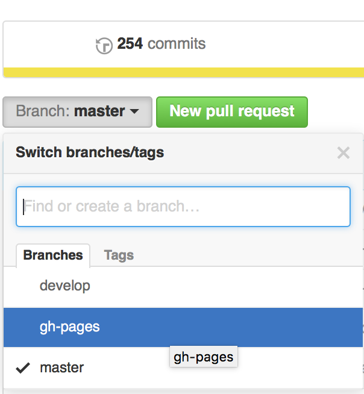

Tutorial: Hosting your own Hackfoldr 2.0
===

*In other languages:*

- [English tutorial](https://github.com/hackfoldr/hackfoldr-2.0-forkme/blob/master/docs/Hosting%20your%20own%20Hackfoldr%202.0.md)
- [中文版](https://github.com/hackfoldr/hackfoldr-2.0-forkme/blob/master/docs/Hosting%20your%20own%20Hackfoldr%202.0%20zh-tw.md)

## What is Hackfoldr 2.0

Hackfoldr is a convenience web folder to store links for your collaborated OSS projects.

A sample folder - http://beta.hackfoldr.org/hackfolder_template

### How does it work

The hackfoldr use ethercalc.org sheet as live configating file. Every row of the sheet represent a link. You can also set the link to open in new window, add subfolder, or append colored label.

## Hosting your own Hackfoldr

*It's as easy as fork & customize*

### Benefit

- Use your own domain name and customize the landing page. 

    For example, http://beta.hackfoldr.org/ linked to ethercalc.org/welcome-to-hackfoldr
    
    And http://folder.moztw.org/ linked to ethercalc.org/moztw, which stored all docs related to MozTW, Mozilla Taiwan Community.

- You will be able to enable the hidden shortcut menu on your own instance.

## Steps

### Step 0: Getting Started

You will need the following to proceed:

- A domain name
- A github account

### Step 1: Fork Hackfoldr 2.0 repo

1. Go to https://github.com/hackfoldr/hackfoldr-2.0-forkme

2. Click the top right “fork” button

### Step 2: Edit `CNAME` file in gh-pages branch

1. Go to your shiny new  repo

2. Switch to `gh-pages` branch at top left branch dropdown button 
   

3. Click and open CNAME file in root directory

4. Click top right “pencil” button to edit the CNAME file

5. Put your domain in the CNAME file

   Make sure that CNAME file contains only One Single Line, [example](https://github.com/hackfoldr/hackfoldr-2.0/blob/gh-pages/CNAME)

### Step 3: Set up your DNS

Add a CNAME record of your domain, and set the destination to `_YOUR_GITHUB_ACCOUNT_.github.io`

- Example for Amazon Router 53

        name: _YOUR_DOMAIN_NAME_.
        type: CNAME
        value: _YOUR_GITHUB_REPO_NAME_.github.io 
        evaluate target: -
        health check id: -
        ttl: 300
  
  Example,  

        name: folder.moztw.org.
        type: CNAME
        value: moztw.github.io
        evaluate target: -
        health check id: -
        ttl: 300   
  

- Example for Cloudflare

   - CNAME: _YOUR_GITHUB_ACCOUNT_.github.io
  eg., etblue.github.io
   - Page Rule: http://etblue.github.io/+ forward http://etblue.github.io

     [Reference]( http://blog.cloudflare.com/introducing-pagerules-url-forwarding/)

    
### Step 4: Customize your Hackfoldr

1. Clone this [template sheet](https://ethercalc.org/hackfolder_template) into new ethercalc, and named whatever SLUG you want

2. Switch to `gh-pages` branch of your forked repo

   Thanks Github for their wonderful [Project Page](https://help.github.com/articles/user-organization-and-project-pages/#project-pages) feature, save us from renting own server for host hackfolder.

3. Edit `index.html` file and adjust the following settings

  - Change the linked ethercalc SLUG on [line 3](https://github.com/hackfoldr/hackfoldr-2.0-forkme/blob/gh-pages/index.html#L3)
  
  - Adjsut the drop-down menu as you wish in `
`
  
  - If you would like to use hackpad page generate feature, adjust default hackpad site on [line 644](https://github.com/hackfoldr/hackfoldr-2.0-forkme/blob/gh-pages/index.html#L644) 

  - Clone everything from index.html to 404.html

### You've done all the works! 

Be patient and waiting for domain name record to be active. It shouldn't cost you too much time, typically no longer then 10 mins.

## Development

Please refer to [this docs](https://g0v.hackpad.com/Developing-Hackfoldr-2.0-nIlIQRMVfyc) (in Chinese for now) or [README](https://github.com/hackfoldr/hackfoldr-2.0-forkme/blob/master/README.md) for contributing Hackfoldr-beta project.